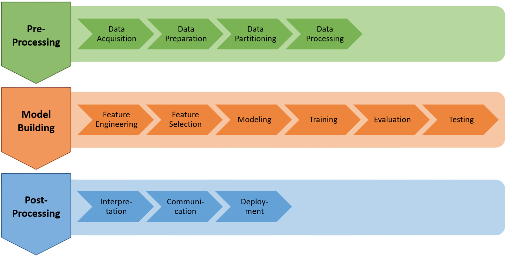

# Data Science Workflow

A data science workflow is an iterative process of human activities used to transform raw data into insights about the data and its domain or create a machine learning model to predict specific data.

## Pipeline
A data science pipeline can be created as part of the data science workflow. It performs the necessary operations to achieve the goals of your data science workflow.

Typically pipelines should have a specific structure to ensure completeness and correctness. 

- *Completeness:* all necessary steps are present.
- *Correctness:* all steps are performed in the correct order and performed on the correct dataset.

Following this structure avoids [data leakage](common-errors.md#data-leakage) and helps other developers understand the pipeline.

### Pipeline layers
A well-structured pipeline consists of three **layers**. 

| Layer | Purpose |
|-------|---------|
| **Pre-Processing** (green) | Explore the data and prepare it for model training. |
| **Model Building** (orange) | Decide on relevant features, then select, train, and evaluate a model. |
| **Post-Processing** (blue) | Translate the model performance back to the target domain. |

Each layer consists of multiple **phases** that each describe a concept in a data science pipeline.

#### Pre-Processing Layer

Explore the data and prepare it for model training.

| Phase | Required? | Description |
|-------|-----------|-------------|
| **Data Acquisition** | Yes | Load data into the pipeline. |
| Data Preparation | No | Exploration and filtering of the entire dataset. |
| **Data Partitioning** | Yes | Split the original dataset into at least 2 datasets (training and test). However, splitting into 3 sets (training, validation, and test) is recommended to avoid data leakage (see [Data leakage](common-errors.md#data-leakage)). See the [split rules](#partitioning-of-data) below. |
| Data Processing | No | Use the training dataset for further exploration or augmentation. You may also apply transformers that do *not* create new features but instead transform existing ones (like scalers or imputers) to every partition consistently. |

#### Model Building Layer

Decide on relevant features, then select, train, and evaluate a model.

| Phase | Required? | Description |
|-------|-----------|-------------|
| Feature Engineering | No | Identify or construct features that are useful to build the model. Transformers that *create new features* (like encoders or discretizers) may be applied to every partition consistently. |
| **Feature Selection** | Yes | In Safe-DS this is a specific step for tabular data: a table is converted to a `TabularDataset` and specific columns are selected as the *target* (to be learned by a model) or as *extra* (neither training nor target features). |
| **Modeling** | Yes | Decide on and build an appropriate model for the data. |
| Training | No | Train the selected model on the training data. (Optional, since you may have loaded a pretrained model during Modeling.) |
| Evaluation | No | After training, evaluate the model on the **validation** set (see [Partitioning of data](#partitioning-of-data)) by calculating metrics like accuracy, precision, and recall. The state of the model may also be plotted (e.g. a decision tree classifier). |
| **Testing** | Yes | After optimizing the hyperparameters to a point where the validation result is satisfactory, use another completely unseen set, the **test** set, to test the generality of the model. Metrics are computed again to examine generality and test for overfitting. In the final instance of the pipeline, this phase is required. |

#### Post-Processing Layer

Translate the model performance back to the target domain.

| Phase | Required? | Description |
|-------|-----------|-------------|
| Interpretation | Yes | Translate results to the target domain by inverse-transforming the target feature or visualizing the model structure (currently available for decision-tree based models). |
| Communication | No | Sharing or publishing the results. Not part of the Safe-DS pipeline. |
| Deployment | No | Installing the model in its problem domain and monitoring its performance over time. Not part of the Safe-DS pipeline. |

### Pipeline activities
Each of these phases consists of **activities** (basically sub-tasks) that are used to achieve the concept of a given layer.
In coding terms, activities are a group of specific functions that are called to achieve the concept.

## Partitioning of data

The most important phase is **Data Partitioning**. Everything before it operates on the whole dataset, everything after
it must respect the boundary between partitions:

- **Training** is used to train transformers as well as the model.
- **Validation** can be used repeatedly to optimize the hyperparameters of the model.
- **Test** should only be used *once*, after the results on the validation set are satisfying, to test the model's
  generality and detect overfitting.

This is why the pre-processing layer distinguishes *pre-split* preparation (Data Preparation) from *post-split*
processing (Data Processing). Operations whose result depends on the *values* in the data — fitting a scaler, an imputer,
or an encoder — must be **fitted on the training set only**, and then applied to the other partitions. If you fit them
before the split, information from the test set (e.g. distribution-based statistics like the mean) leaks into training.

Learn more about data leakage [here](common-errors.md#data-leakage).

## Read more

- Biswas, S., Wardat, M., & Rajan, H. (2022). *The art and practice of data science pipelines.* In Proceedings of the
  44th International Conference on Software Engineering (ICSE '22), 2091–2103.
  <https://doi.org/10.1145/3510003.3510057>