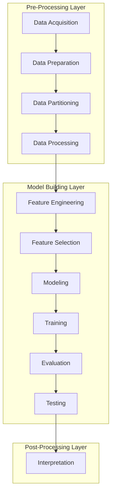

# Pipeline Structure

In theory, all data science pipelines should be structured in a similar way. A well-structured pipeline is an ordered
sequence of **phases**, grouped into three **layers**. Your pipeline does not have to use every phase, but the phases it
does use should appear in the order below. Some phases are essential; others are optional and may be repeated.

## The three layers

| Layer | Purpose |
|-------|---------|
| **Pre-Processing** | Explore the data and prepare it for model training. |
| **Model Building** | Decide on relevant features, then select, train, and evaluate a model. |
| **Post-Processing** | Translate the model performance back to the target domain. |

Each layer consists of multiple phases, each including multiple [activities](activities.md).

## Pre-Processing Layer

Explore the data and prepare it for model training.

| Phase | Required? | Description |
|-------|-----------|-------------|
| **Data Acquisition** | ✅ Yes | Load data into the pipeline. |
| Data Preparation | Optional | Exploration and filtering of the entire dataset. |
| **Data Partitioning** | ✅ Yes | Split the original dataset into at least 2 datasets (training and test). Splitting into 3 sets (training, validation, and test) is recommended. See [the split rules](#the-split-is-the-pivot) below. |
| Data Processing | Optional | Use the training dataset for exploration, augmentation, cleaning, and transformers that do *not* create new features but instead transform existing ones (like scalers or imputers). |

## Model Building Layer

Decide on relevant features, then select, train, and evaluate a model.

| Phase | Required? | Description |
|-------|-----------|-------------|
| Feature Engineering | Optional | Identify or construct features that are useful to build the model. Transformers that *create new features* may be used here (like encoders or discretizers). |
| **Feature Selection** | ✅ Yes | In Safe-DS this is a specific step for tabular data: a table is converted to a `TabularDataset` and specific columns are selected as the *target* (to be learned by a model) or as *extra* (neither training nor target features). |
| **Modeling** | ✅ Yes | Decide on and build an appropriate model for the data. |
| Training | Optional | Train the selected model on the training data. (Optional, since you may load a pretrained model.) |
| Evaluation | Optional | After training, evaluate the model on the **validation** set (a set not used for training) by calculating metrics like accuracy, precision, and recall. The state of the model may also be plotted (e.g. a decision tree classifier). |
| Testing | Optional | After optimizing the hyperparameters to a point where the validation result is satisfactory, use another completely unseen set — the **test** set — to test the generality of the model. Metrics are computed again to examine generality and test for overfitting. |

## Post-Processing Layer

Translate the model performance back to the target domain.

| Phase | Part of pipeline? | Description |
|-------|-------------------|-------------|
| Interpretation | ✅ Yes | Translate results to the target domain by inverse-transforming the target feature or visualizing the model structure (currently available for decision-tree based models). |
| Communication | ❌ No | Sharing or publishing the results. Not part of the Safe-DS pipeline. |
| Deployment | ❌ No | Installing the model in its problem domain and monitoring its performance over time. Not part of the Safe-DS pipeline. |

!!! note "Essential phases"

    A well-formed pipeline contains at least **Data Acquisition**, **Data Partitioning**, **Feature Selection**, and
    **Modeling**. The other pipeline phases are optional, but when present they should keep their place in the order
    above. Communication and Deployment are conceptual steps that follow a project *beyond* the Safe-DS pipeline.

## The split is the pivot

The single most important step is the **Data Partitioning** phase. Everything before it operates on the whole dataset;
everything after it must respect the boundary between partitions:

- **Training** is used to train transformers as well as the model.
- **Validation** can be used repeatedly to optimize the hyperparameters of the model.
- **Test** should only be used *once*, after the results on the validation set are satisfying, to test the model's
  generality and detect overfitting.

This is why the pre-processing layer distinguishes *pre-split* preparation (Data Preparation) from *post-split*
processing (Data Processing). Operations whose result depends on the *values* in the data — fitting a scaler, an imputer,
or an encoder — must be **fitted on the training set only**, and then applied to the other partitions. If you fit them
before the split, statistics from the test set leak into training.

## Data-partition rules

After the split, some activities should only ever touch a specific partition. Applying them to the wrong one risks data
leakage.

| Phase | Activity | Allowed partition |
|-------|----------|-------------------|
| Data Processing | Exploration, post-split cleaning, augmentation | Training only |
| Data Processing | Data transformation, schema modification, utilities | Any partition |
| Evaluation | Prediction, metric calculation | Validation only |
| Testing | Prediction, metric calculation | Test only |

The reason exploration, cleaning, and augmentation are training-only is the same as above: they are decisions you make by
looking at the data, and you must not make them by looking at data the model will later be judged on.

!!! warning "Do not tune on the test set"

    Evaluation runs on the **validation** set — that is the set you are allowed to look at repeatedly while tuning
    hyperparameters. The **test** set is used *once*, in the Testing phase, to estimate how the model generalizes to
    unseen data. The moment you make a modeling decision based on the test score, that score stops being an honest
    estimate of generality.

## Reusing code across partitions

Because the same processing must be applied to every partition, it is good practice to encapsulate post-split steps in a
[segment](../pipeline-language/segments.md) and call it once per partition. This guarantees the training and test data go
through exactly the same steps and removes the risk of forgetting one. See
[Reusing Code with Segments](../getting-started/first-classification-program.md#reusing-code-with-segments) for a worked
example.

## See also

- [Activities](activities.md) — the full list of activities available in each phase.

## Read more

- Biswas, S., Wardat, M., & Rajan, H. (2022). *The art and practice of data science pipelines.* In Proceedings of the
  44th International Conference on Software Engineering (ICSE '22), 2091–2103.
  <https://doi.org/10.1145/3510003.3510057>